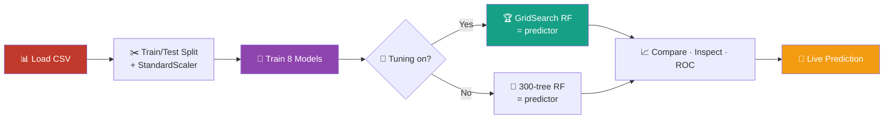

<div align="center">

# 🍷 Wine Quality Classifier

### An interactive Gradio web app that trains, compares & deploys 8 ML models to predict red-wine quality

<br>


<br>

*Pick your split → train 8 classifiers in seconds → compare them visually → predict any wine.*
*All from a browser tab — no code required once it's running.* 🚀

</div>

---

## 📑 Table of Contents

- [✨ Features](#-features)
- [🎬 Quick Start](#-quick-start)
- [🖥️ The Interface](#️-the-interface)
- [🧠 Models Under the Hood](#-models-under-the-hood)
- [📊 The Dataset](#-the-dataset)
- [📁 Project Structure](#-project-structure)
- [⚙️ How It Works](#️-how-it-works)
- [🛠️ Run Locally](#️-run-locally)
- [⚠️ A Note on Data Leakage](#️-a-note-on-data-leakage)
- [🗺️ Roadmap](#️-roadmap)
- [🤝 Contributing](#-contributing)
- [📜 License](#-license)

---

## ✨ Features

| | Feature | What you get |
|:--:|:--|:--|
| 🎛️ | **Configurable training** | Tune the train/test split and toggle GridSearch hyperparameter tuning from the UI |
| 🤖 | **8 classifiers** | Logistic Regression, Decision Tree, Random Forest, KNN, SVM, Gradient Boosting, Naive Bayes + a tuned RF |
| 📈 | **Visual comparison** | Grouped metric bars and overlaid **ROC curves** with AUC for every model |
| 🔍 | **Per-model inspection** | Confusion matrix + 5-fold cross-validation (mean & std F1) |
| 🌿 | **Feature importance** | See which chemical properties drive the prediction |
| 🔮 | **Live prediction** | Slide 16 feature values — or load a real test sample — and get an instant Good / Not-Good verdict with probability |
| ☁️ | **Colab-ready** | One notebook, three cells, a public `*.gradio.live` link |

---

## 🎬 Quick Start

### ▶️ Option A — Google Colab (recommended, zero setup)

```text
1. Open  wine_quality_gradio_colab.ipynb  in Google Colab
   (File → Upload notebook)
2. Run the 3 cells top to bottom:
     ① Install dependencies
     ② Upload  winequality-red_cleaned.csv
     ③ Launch  →  click the public *.gradio.live link
```

> 💡 The `share=True` link stays live for **72 hours** or until you stop the cell.

### ▶️ Option B — Local machine

```bash
# clone
git clone https://github.com/<your-username>/wine-quality-classifier.git
cd wine-quality-classifier

# install
pip install gradio scikit-learn pandas numpy matplotlib

# run
python wine_quality_gradio_colab.py
```

Then open the local URL printed in your terminal (default `http://localhost:7860`). 🎉

---

## 🖥️ The Interface

The app is organized into **five tabs**, designed to flow left-to-right:

```
┌─────────────────────────────────────────────────────────────────────────┐
│  1 · Train  │  2 · Compare  │  3 · Inspect  │  4 · Features  │  5 · Predict │
└─────────────────────────────────────────────────────────────────────────┘
```

| Tab | Icon | Purpose |
|:--|:--:|:--|
| **1 · Train** | 🚀 | Choose test size, enable RF tuning, train all models → metrics table sorted by F1 |
| **2 · Compare** | 📊 | Grouped bar chart of Accuracy / Precision / Recall / F1 + ROC curves |
| **3 · Inspect** | 🔬 | Confusion matrix and 5-fold CV F1 for any single model |
| **4 · Features** | 🌿 | Top-15 feature importances from the Random Forest predictor |
| **5 · Predict** | 🔮 | 16 sliders (seeded from real data ranges) → Good / Not-Good + probability |

---

## 🧠 Models Under the Hood

All eight are trained on the binary **`good_quality`** target with `class_weight="balanced"` where applicable (the positive class is only **~13.6%** of the data).

| # | Model | Input | Notes |
|:--:|:--|:--:|:--|
| 1 | 🟦 Logistic Regression | scaled | `max_iter=2000`, balanced |
| 2 | 🌳 Decision Tree | raw | balanced |
| 3 | 🌲 Random Forest | raw | 300 trees, balanced |
| 4 | 📍 KNN | scaled | **K auto-optimized** over 1–20 |
| 5 | ➿ SVM (RBF) | scaled | probability-enabled, balanced |
| 6 | ⚡ Gradient Boosting | raw | default sklearn |
| 7 | 🧮 Naive Bayes | raw | GaussianNB |
| 8 | 🏆 **Random Forest (Tuned)** | raw | **GridSearch** over depth / estimators / splits → final predictor |

> 🔧 Models requiring feature scaling (LR, KNN, SVM) use a `StandardScaler`; tree-based and NB models use raw inputs — exactly as in the source notebook.

---

## 📊 The Dataset

**Red wine physicochemical properties** → predict whether a wine is *good quality*.

<div align="center">

| 🍷 Samples | 🎯 Good-quality rate | 🧪 Features | 🎚️ Target |
|:--:|:--:|:--:|:--:|
| **1,599** | **13.6%** | **16** | `good_quality` (0/1) |

</div>

<details>
<summary>🔬 <b>Click to see all 16 features</b></summary>

<br>

**Original physicochemical measurements**
`fixed_acidity` · `volatile_acidity` · `citric_acid` · `residual_sugar` · `chlorides` · `free_sulfur_dioxide` · `total_sulfur_dioxide` · `density` · `pH` · `sulphates` · `alcohol`

**Engineered features**
`total_acidity` · `acidity_ratio` · `free_to_total_sulfur` · `alcohol_level_medium` · `alcohol_level_high`

</details>

---

## 📁 Project Structure

```
wine-quality-classifier/
├── 🍷 wine_quality_gradio_colab.ipynb   # ← main deliverable (run this in Colab)
├── 🐍 wine_quality_gradio_colab.py      # script version of the same app
├── 📓 03_model_building.ipynb           # original modeling notebook
├── 📊 winequality-red_cleaned.csv       # the dataset
└── 📖 README.md                         # you are here
```

---

## ⚙️ How It Works



1. **Load** the cleaned CSV (auto-located in `/content/` on Colab).
2. **Split** 80/20 (configurable), stratified, then scale features for the models that need it.
3. **Train** all eight classifiers; KNN sweeps K = 1…20 to pick the best.
4. **Tune** Random Forest via 5-fold GridSearch (optional) — this becomes the live predictor.
5. **Explore** results through interactive plots and predict new samples on demand.

---

## 🛠️ Run Locally

<details>
<summary>📦 <b>Full local setup</b></summary>

<br>

```bash
# 1. create a virtual environment (optional but recommended)
python -m venv venv
source venv/bin/activate        # Windows: venv\Scripts\activate

# 2. install dependencies
pip install gradio scikit-learn pandas numpy matplotlib

# 3. make sure the CSV sits next to the script
ls winequality-red_cleaned.csv

# 4. launch
python wine_quality_gradio_colab.py
```

The script auto-detects the CSV in the current folder, `/content/`, or a `data/` subfolder.

</details>

---

## ⚠️ A Note on Data Leakage

> The dataset includes **engineered features** (`total_acidity`, `acidity_ratio`, `free_to_total_sulfur`, `alcohol_level_medium`, `alcohol_level_high`).
> If any of these were derived from the original quality score, they may **leak target information** and inflate scores.
> The app keeps them by default to match the source notebook — drop them if you want a strictly honest benchmark.

---

## 🗺️ Roadmap

- [ ] 🔘 Toggle to exclude engineered/leaky features
- [ ] 💾 Download trained model as a `.pkl`
- [ ] 📥 Batch prediction via CSV upload
- [ ] 📉 SHAP-based per-prediction explanations
- [ ] 🍇 Extend to the white-wine dataset

---

## 🤝 Contributing

Contributions, issues, and feature requests are welcome! 💛

```bash
1. 🍴 Fork the repo
2. 🌱 Create your branch   →  git checkout -b feature/amazing-thing
3. 💾 Commit your changes  →  git commit -m 'Add amazing thing'
4. 🚀 Push to the branch   →  git push origin feature/amazing-thing
5. 🎉 Open a Pull Request
```

---

## 📜 License

Distributed under the **MIT License**. See `LICENSE` for details.

---

<div align="center">

### ⭐ If this project helped you, consider giving it a star!

**Built with** 🐍 Python · 🤖 scikit-learn · 🎨 Gradio

<sub>Dataset: Red Wine Quality (physicochemical properties) · Made for learning & experimentation</sub>

</div>
